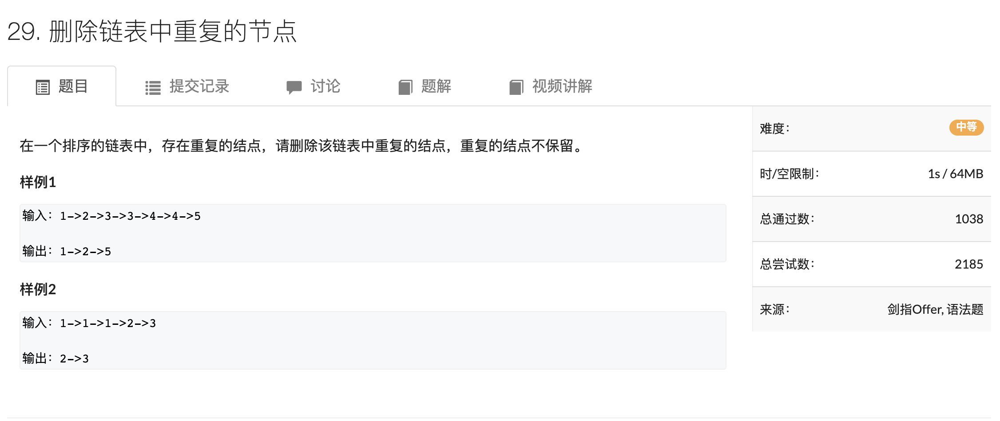

[TOC]

# [Return Qi's Website]([http://qw2261.github.io](http://qw2261.github.io/))

# C++笔记

1 scanf不支持string，或者说，不支持c++的类

2 $max(a, b) = \frac{a + b + abs(a - b)}{2}$

3 while (cir >> x, x): 先输入x再判断x

4 xcode-select --install: 装载g++

## 1. AcWing 78.  左旋字符串

分解操作，先整个翻转，再把前n-k个翻转，再把后k个翻转

```c++
string leftRotateString(string str, int n)
{
  int size = str.size();
  reverse(str.begin(), str.end());
  reverse(str.begin(), str.begin() + size - n);
  reverse(str.begin() + size - n, str.end());
}
```

## 2. AcWing 87. 把字符串转换为整数


```c++
class Solution {
public:
    int strToInt(string str) {
        int k = 0;
        while (k < str.size() && str[k] == ' ') k ++;

        long long number = 0;
        bool is_minus = false;
        if (str[k] == '+') k ++;
        else if (str[k] == '-') k ++, is_minus = true;

        while (k < str.size() && str[k] >= '0' && str[k] <= '9')
        {
            number = number * 10 + str[k] - '0';
            k ++;
        }

        if (is_minus) number *= -1;
        if (number > INT_MAX) return INT_MAX;
        else if (number < INT_MIN) return INT_MIN;
        else return (int)number;
    }
};
```

## 3. AcWing 84. 求1+2+…+n


```c++
class Solution {
public:
    int getSum(int n) {
        int res = n;
        n > 0 && (res += getSum(n - 1));
        return res;
    }
};
```

##4. AcWing 28. 在O(1)时间删除链表结点


```c++
/**
 * Definition for singly-linked list.
 * struct ListNode {
 *     int val;
 *     ListNode *next;
 *     ListNode(int x) : val(x), next(NULL) {}
 * };
 */
class Solution {
public:
    void deleteNode(ListNode* node) {
        
        node->val = node->next->val;
        node->next = node->next->next;
    }
};
```

## 5. AcWing 36. 合并两个排序的链表


```c++
/**
 * Definition for singly-linked list.
 * struct ListNode {
 *     int val;
 *     ListNode *next;
 *     ListNode(int x) : val(x), next(NULL) {}
 * };
 */
class Solution {
public:
    ListNode* merge(ListNode* l1, ListNode* l2) {
        ListNode* dummy = new ListNode(0);
        ListNode* cur = dummy;
        while (l1 != NULL && l2 != NULL)
        {
            if (l1->val < l2->val)
            {
                cur->next = l1;
                l1 = l1->next;
            }
            else
            {
                cur->next = l2;
                l2 = l2->next;
            }
            cur = cur->next;
        }
        if (l1 != NULL) cur->next = l1;
        else cur->next = l2;

        return dummy->next;
    }
};
```

##6. AcWing 35. 反转链表


```c++
/**
 * Definition for singly-linked list.
 * struct ListNode {
 *     int val;
 *     ListNode *next;
 *     ListNode(int x) : val(x), next(NULL) {}
 * };
 */
class Solution {
public:
    ListNode* reverseList(ListNode* head) {
      ListNode* prev = nullptr;
      auto cur = head;
      
      while (cur)
      {
        auto next = cur->next;
        cur->next = prev;
        prev = cur;
        cur = next;
      }
      return prev;
    }
};
```

##7. AcWing 66. 两个链表的第一个公共结点


```c++
/**
 * Definition for singly-linked list.
 * struct ListNode {
 *     int val;
 *     ListNode *next;
 *     ListNode(int x) : val(x), next(NULL) {}
 * };
 */
class Solution {
public:
    ListNode *findFirstCommonNode(ListNode *headA, ListNode *headB) {
        auto p = headA, q = headB;
        while(p != q)
        {
            if (p) p = p->next;
            else p = headB;
            if (q) q = q->next;
            else q = headA;
        }
        return q;
    }
};
```

## 8. AcWing 29. 删除链表中重复的节点



```c++
/**
 * Definition for singly-linked list.
 * struct ListNode {
 *     int val;
 *     ListNode *next;
 *     ListNode(int x) : val(x), next(NULL) {}
 * };
 */
class Solution {
public:
    ListNode* deleteDuplication(ListNode* head) {
        auto dummy = new ListNode(0);
        dummy->next = head;

        auto p = head;
        while (p->next)
        {
            auto q = p->next;
            while (q && p->next->val == q->val) q = q->next;
            if (p->next->next == q) p = p->next;
            else p->next = q;
        }
        return dummy->next;
    }
};
```

## 9. AcWing 68. 0到n-1中缺失的数字


```c++
class Solution {
public:
    int getMissingNumber(vector<int>& nums) {
        if (nums.empty()) return 0;

        int l = 0, r = nums.size();

        while (l < r)
        {
            int mid = l + r >> 1;
            if (nums[mid] != mid) r = mid;
            else l = mid + 1;
        }
        return l;
    }
};
```

## 10. AcWing 17. 从尾到头打印链表


```c++
/**
 * Definition for singly-linked list.
 * struct ListNode {
 *     int val;
 *     ListNode *next;
 *     ListNode(int x) : val(x), next(NULL) {}
 * };
 */
class Solution {
public:
    vector<int> printListReversingly(ListNode* head) {
        vector<int> res;
        while (head)
        {
            res.push_back(head->val);
            head = head->next;
        }
        return vector<int>(res.rbegin(), res.rend());
    }
};
```

## 11. AcWing 20. 用两个栈实现队列


```c++
class MyQueue {
public:
    /** Initialize your data structure here. */
    stack<int> stk, cache;
    MyQueue() {

    }
    void copy(stack<int> &a, stack<int> &b)
    {
        while (a.size())
        {
            b.push(a.top());
            a.pop();
        }
    }

    /** Push element x to the back of queue. */
    void push(int x) {
        stk.push(x);
    }

    /** Removes the element from in front of queue and returns that element. */
    int pop() {
        copy(stk, cache);
        int res = cache.top();
        cache.pop();
        copy(cache, stk);
        return res;
    }

    /** Get the front element. */
    int peek() {
        copy(stk, cache);
        int res = cache.top();
        copy(cache, stk);
        return res;
    }

    /** Returns whether the queue is empty. */
    bool empty() {
        return stk.empty();
    }
};

/**
 * Your MyQueue object will be instantiated and called as such:
 * MyQueue obj = MyQueue();
 * obj.push(x);
 * int param_2 = obj.pop();
 * int param_3 = obj.peek();
 * bool param_4 = obj.empty(); 
 */
```

## 12. AcWing 32. 调整数组顺序使奇数位于偶数前面


```c++
class Solution {
public:
    void reOrderArray(vector<int> &array) {
        int l = 0, r = array.size() - 1;
        while (l < r)
        {
            while (l < r && array[l] % 2 != 0) l ++;
            while (l < r && array[r] % 2 == 0) r --;
            if (l < r) swap(array[l], array[r]);
        }

    }
};
```

## 13. AcWing 53. 最小的k个数


```c++
class Solution {
public:
    vector<int> getLeastNumbers_Solution(vector<int> input, int k) {
        priority_queue<int> heap;
        for (auto x : input)
        {
            heap.push(x);
            if (heap.size() > k) heap.pop();
        }

        vector<int> res;
        while (heap.size()) res.push_back(heap.top()), heap.pop();
        reverse(res.begin(), res.end());


        return res;
    }
};
```

## 14. AcWing 75. 和为S的两个数字


```c++
class Solution {
public:
    vector<int> findNumbersWithSum(vector<int>& nums, int target) {
        unordered_set<int> hash;
        for (int i = 0; i < nums.size(); i ++)
        {
            if (hash.count(target - nums[i])) return vector<int>{target - nums[i], nums[i]};
            hash.insert(nums[i]);
        }
    }
};
```

## 15. AcWing 40. 顺时针打印矩阵


```c++
class Solution {
public:
    vector<int> printMatrix(vector<vector<int> > matrix) {
        vector<int> res;
        if (matrix.empty()) return res;
        int n = matrix.size(), m = matrix[0].size();
        vector<vector<bool>> st(n, vector<bool>(m, false));
        int dx[4] = {0, 1, 0, -1}, dy[4] = {1, 0, -1, 0};
        int x = 0, y = 0, d = 0;
        for (int k = 0; k < n * m; k ++)
        {
            res.push_back(matrix[x][y]);
            st[x][y] = true;
            int a = x + dx[d], b = y + dy[d];
            if (a < 0 || a >= n || b < 0 || b >= m || st[a][b])
            {
                d = (d + 1) % 4;
                a = x + dx[d], b = y + dy[d];
            }
            x = a, y = b;
        }
        return res;
    }
};
```

# 数据结构和算法


# 算法基础课

## 第一章 基础算法（一）

### 快排

```c++
#include <iostream>

using namespace std;

const int N = 1e6 + 10;

int n;
int q[N];


void quick_sort(int q[], int l, int r)
{
  if (l >= r) return;
  
  int x = q[l], i = l - 1, j = r + 1;
  while (i < j)
  {
    do i ++; while (q[i] < x);
    do j --; while (q[j] > x);
    if (i < j) swap(q[i], q[j]);
  }
  
  quick_sort(q, l, j), quick_sort(q, j + 1, r);
  // quick_sort(q, l, i - 1), quick_sort(q, i, r);
  // 之前的x变为q[r], q[(l + r + 1) / 2], 边界问题
}

int main()
{
  scanf("%d", &n);
  
  for (int i = 0; i < n; i ++) scanf("%d", &q[i]);
  
  quick_sort(q, 0, n - 1);
  
  for (int i = 0; i < n; i ++) printf("%d", q[i]);
  
  return 0;
  
}
```

### 归并排序

```c++
#include <iostream>

using namespace std;

const int N = 1000010;
int n;
int q[N], tmp[N];

void merge_sort(int q[], int l, int r)
{
  if (l >= r) return;
  
  int mid = l + r >> 1;
  
  merge_sort(q, l , mid), merge_sort(q, mid + 1, r);
  
  int k = 0, i = 1, j = mid + 1;
  
  while (i <= mid && j <= r)
    if (q[i] <= q[j]) tmp[k ++] = q[i ++];
  	else tmp[k ++] = q[j ++];
  
  while (i <= mid) tmp[k ++] = q[i ++];
  while (j <= r) tmp[k ++] = q[j ++];
  
  for (i = l, j = 0; i <= r; i ++, j ++) q[i] = tmp[j];
}

int main()
{
  scanf("%d", n);
  
  for (int i = 0; i < n; i ++) scanf("%d", &q[i]);
  
  merge_sort(q, 0, n - 1);
  
  for (int i = 0; i < n; i ++) printf("%d", q[i]);
  
  return 0;
}
```

### 整数二分

```c++
bool check(int x) {/* ... */} // 检查x是否满足某种性质

// 区间[l, r]被划分成[l, mid]和[mid + 1, r]时使用：
int bsearch_1(int l, int r)
{
    while (l < r)
    {
        int mid = l + r >> 1;
        if (check(mid)) r = mid;    // check()判断mid是否满足性质
        else l = mid + 1;
    }
    return l;
}
// 区间[l, r]被划分成[l, mid - 1]和[mid, r]时使用：
int bsearch_2(int l, int r)
{
    while (l < r)
    {
        int mid = l + r + 1 >> 1;
        if (check(mid)) l = mid;
        else r = mid - 1;
    }
    return l;
}
```

```c++
// AcWing 789, 数的范围
#include <iostream>

using namespace std;

const int N = 100010;

int n, m;
int q[N];

int main()
{
  scanf("%d%d", &n, &m);
  for (int n = 0; i < n; i ++) scanf("%d", &q[i]);
  
  while (m --)
  {
    int x;
    scanf("%d", &x);
    
    int l = 0, r = n - 1;
    while (l < r)
    {
      int mid = l + r >> 1;
      if (q[mid >= x]) r = mid;
      else l = mid + 1;
    }
    if (q[l] != x) cout << "-1 -1" << endl;
    else
    {
      cout << l << ' ';
      
      int l = 0, r = n - 1;
      while (l < r)
      {
        int mid = l + r + 1 >> 1;
        if (q[mid] <= x) l = mid;
        else r = mid - 1;
      }
      
      cout << l << endl;
    }
  }
  
  return 0;
}
```

### 浮点数二分

```c++
bool check(double x) {/* ... */} // 检查x是否满足某种性质

double bsearch_3(double l, double r)
{
    const double eps = 1e-6;   // eps 表示精度，取决于题目对精度的要求
    while (r - l > eps)
    {
        double mid = (l + r) / 2;
        if (check(mid)) r = mid;
        else l = mid;
    }
    return l;
}
```

```c++
// Sqrt
#include <iostream>

using namespace std;

int main()
{
  double x;
  cin >> x;
  
  double l = 0, r = x;
  while (r - l > 1e-8) //要求高一些
  {
    doubel mid = (l + r) / 2;
    if (mid * mid >= x) r = mid;
    else l = mid;
  }
  
  printf("%lf\n", l);
  
  return 0;
}
```

## 第一章 基础算法（二）

### 高精度加法

```c++
#include <iostream>
#include <vector>

using namespace std;

// C = A + B
vector<int> add(vector<int> &A, vector<int> &B)
{
  vector<int> C;
  
  int t = 0;
  for (int i = 0; i < A.size() || i < B.size(); i ++)
  {
    if (i < A.size()) t += A[i];
    if (i < B.size()) t += B[i];
    C.push_back(t % 10);
    t /= 10;
  }
  
  if (t) C.push_back(1);
  return C;
}

int main()
{
  string a, b;
  vector<int> A, B;
  
  cin >> a >> b; // a = "123456"
  for (int i = a.size() - 1; i >= 0; i --) A.push_back(a[i] - '0'); // A = [6, 5, 4, 3, 2, 1]
  for (int i = b.size() - 1; i >= 0; i --) B.push_back(b[i] - '0');
  
  auto C = add(A, B);
  
  for (int i = C.size(); i >= 0; i --) printf("%d", C[i]);
  
  return 0;
}
```

```c++
vector<int> add(vector<int> &A, vector<int> &B)
{
    if (A.size() < B.size()) return add(B, A);
    
    vector<int> C;
    int t = 0;
    for (int i = 0; i < A.size(); i ++ )
    {
        t += A[i];
        if (i < B.size()) t += B[i];
        C.push_back(t % 10);
        t /= 10;
    }
    
    if (t) C.push_back(t);
    return C;
}
```

### 高精度减法（假定A和B都是正数）->可以转换成绝对值相减，和相加的情况

```c++
#include <iostream>
#include <vector>

using namespace std;

// 判断A是否大于等于B
bool cmp(vector<int> &A, vector<int> &B)
{
  if (A.size() != B.size()) return A.size() > B.size();
  for (int i = A.size() - 1; i >= 0; i --)
  {
    if (A[i] != B[i])
      return A[i] > B[i];
  }
  return true;
}


// C = A - B
vector<int> sub(vector<int> &A, vector<int> &B)
{
  vector<int> C;
  for (int i = 0, t = 0; i < A.size(); i ++)
  {
    t = A[i] - t;
    if (i < B.size()) t -= B[i];
    C.push_back((t + 10) % 10);
    if (t < 0) t = 1;
    else t = 0;
  }
  
  while (C.size() > 1 && C.back() == 0) C.pop_back(); 
  //去掉多余的0，前导0
  
  return C;
}

int main()
{
  string a, b;
  vector<int> A, B;
  
  cin >> a >> b; // a = "123456"
  for (int i = a.size() - 1; i >= 0; i --) A.push_back(a[i] - '0'); // A = [6, 5, 4, 3, 2, 1]
  for (int i = b.size() - 1; i >= 0; i --) B.push_back(a[i] - '0');
  
  if (cmp(A, B))
  {
    auto C = sub(A, B);
    for (int i = C.size(); i >= 0; i --) printf("%d", C[i]);
  }
  else
  {
    auto C = sub(B, A);
    printf("-");
    for (int i = C.size(); i >= 0; i --) printf("%d", C[i]);
  }
  
  
  
  return 0;
}
```

### 高精度乘法

```c++
#include <iostream>
#include <vector>

using namespace std;


// C = A * b
vector<int> mul(vector<int> &A, int b)
{
  vector<int> C;
  
  int t = 0;
  for (int i = 0; i < A.size() || t; i ++)
  {
    if (i < A.size()) t += A[i] * b;
    C.push_back(t % 10);
    t /= 10;
  }
  
  return C;
}


int main()
{
  string a;
  int b;
  cin >> a >> b;
  
  vector<int> A;
  for (int i = a.size() - 1; i >= 0; i --) A.push_back(a[i] - '0');
  
  auto C = mul(A, b);
  
  for (int i = C.size() - 1; i >= 0; i --) printf("%d", C[i]);
  
  return 0;
}
```

### 高精度除法

```c++
#include <iostream>
#include <vector>
#include <algorithm>

using namespace std;


// C = A / b，商是C，余数是r
vector<int> div(vector<int> &A, int b, int &r)
{
  vector<int> C;
  
  r = 0;
  for (int i = A.size() - 1; i >= 0; i --)
  {
    r = r * 10 + A[i];
    C.push_back(r / b);
    r = r % b;
  }
  
  reverse(C.begin(), C.end());
  
  while (C.size() >  1 && C.back() == 0) C.pop_back();
  
  return C;
}


int main()
{
  string a;
  int b;
  cin >> a >> b;
  
  vector<int> A;
  for (int i = a.size() - 1; i >= 0; i --) A.push_back(a[i] - '0');
  
  int r;
  auto C = div(A, b, r);
  
  for (int i = C.size() - 1; i >= 0; i --) printf("%d", C[i]);
  cout << endl << r << endl;
  
  return 0;
}
```

### 前缀和

```c++
// AcWing 795. 前缀和
#include <iostream>

using namespace std;

const int N = 100010;

int n, m;
int a[N], s[N];

int main()
{
  ios:sync_with_stdio(false);
  // 让cin和标准输入输出不同步，提高cin读取速度
  
  scanf("%d%d", &n, &m);
  for (int i = 1; i <= n; i ++) scanf("%d", &a[i]);
  
  for (int i = 1; i <= n; i ++) s[i] = s[i - 1] + a[i]; // 前缀和的计算
  
  while (m --)
  {
    int l, r;
    scanf("%d%d", &l, &r);
    printf("%d\n", s[r] - s[l - 1]); // 区间和的计算
  }
  
  
  return 0;
}
```

### 二维前缀和

```c++
// AcWing 796. 子矩阵的和
#include <iostream>

const N = 1010;

int n, m, q;
int a[N][N], s[N][N];

int main()
{
  scanf("%d%d%d", &n, &m, &q);
  
  for (int i = 1; i <= n; i ++)
  {
    for (int j = 1; j <= m; j ++)
    {
      scanf("%d", &a[i][j]);
    }
  }
  
  for (int i = 1; i <= n; i ++)
  {
    for (int j = 1; j <= m; j ++)
    {
      s[i][j] = s[i - 1][j] + s[i][j - 1] - s[i - 1][j - 1] + a[i][j]; // 前缀和
    }
  }
  
  while (q --)
  {
    int x1, y1, x2, y2;
    scanf("%d%d%d%d", &x1, &y1, &x2, &y2);
    printf("%d\n", s[x2][y2] - s[x1 - 1][y2] - s[x2][y1 -1] + s[x1 - 1][y1 - 1]); // 算子矩阵的和
  }
  
  return 0;
}
```

### 差分

```c++
// AcWing 797. 差分

#include <iostream>

using namespace std;

const int N = 100010;

int n, m;
int a[N], b[N];

void insert(int l, int r, int c)
{
  b[l] += c;
  b[r + 1] -= c;
}


int main()
{
  scanf("%d%d", &n, &m);
  for (int i = 1; i < n; i ++) scanf("%d", &a[i]);
  
  for (int i = 1; i < n; i ++) insert(i, i, a[i]);
  
  while (m --)
  {
    int l, r, c;
    scanf("%d%d%d", &l, &r, &c);
    insert(l, r, c);
  }
  
  for (int i = 1; i <= n; i ++) b[i] += b[i - 1];
  
  for (int i = 1; i <= n; i ++) printf("%d", b[i]);
  
  
  
  return 0;
}

```

### 二维差分

```c++
// AcWing 798. 差分矩阵
#incude <iostream>

using namespace std;

const int N = 1010;

int n, m, q;
int a[N][N], b[N][N];

void insert(int x1, int y1, int x2, int y2)
{
  b[x1][y1] += c;
  b[x2 + 1][y1] -= c;
  b[x1][y2 + 1] -= c;
  b[x2 + 1][y2 + 1] += c;
}


int main()
{
  scanf("%d%d", &n, &m, &q);
  
  for (int i = 1; i <= n; i ++)
  {
    for (int j = 1; j <= m; j ++)
    {
      scanf("%d", &a[i][j]);
    }
  }
  
  for (int i = 1; i <= n; i ++)
  {
    for (int j = 1; j <= m; j ++)
    {
      insert(i, j, i, j, a[i][j]);
    }
  }
  
  while (q --)
  {
    int x1, y1, x2, y2, c;
    cin >> x1 >> y1 >> x2 >> y2 >> c;
    insert(x1, y1, x2, y2, c);
  }
  
  for (int i = 1; i <= n; i ++)
  {
    for (int j = 1; j <= m ; j ++)
    {
      b[i][j] += b[i - 1][j] + b[i][j - 1] - b[i - 1][j - 1];
    }
  }
  
  for (int i = 1; i <= n; i ++)
  {
    for (int j = 1; j <= m; j ++) printf("%d", b[i][j]);
    puts("");
  }
  
  return 0;
}
```

## Week 1. 习题课

### 1. AcWing 786. 第k个数


```c++
#include <iostream>

using namespace std;

const int N = 1e5 + 10;

int n, k;
int q[N];

int quick_sort(int l, int r, int k)
{
  if (l == r) return q[l];
  
  int q[l], i = l - 1, j = r + 1;
  
  while (i < j)
  {
    while (q[++ i] < x);
    while (q[-- j] > x);
    if (i < j) swap(q[i], q[j]);
  }
  
  int sl = j - 1 + 1;
  if (k <= sl) return quick_sort(l, j, k);
  
  return quick_sort(j + 1, r, k - sl);
}

int main()
{
  cin >> n >> k;
  
  for (int i = 0; i < n; i ++) cin >> q[i];
  
  cout<< quick_sort(0, n - 1, k) << endl;
  
  return 0;
}
```

### 2. AcWing 788. 逆序对的数量


```c++
#inlcude <iostream>

using namespace std;

typedef long long LL;

const int N = 100010;

int n, q[N], tmp[N];

LL merge_sort(int l, int r)
{
  if (l >= r) return 0;
  
  int mid = l + r >> 1;
  LL res = merge_sort(l, mid) + merge_sort(mid + 1, r);
  
  // 归并过程
  int k = 0, i = l, j = mid + 1;
  while (i <= mid && j <= r)
  {
    if (q[i] < q[j]) tmp[k ++] = q[i ++];
    else
    {
      tmp[k ++] = q[j ++];
      res += mid - i + 1;
    }
  }
  
  // 物归原主
  while (i <= mid) tmp[k ++] = q[i ++];
  while (j <= r) tmp[k ++] = q[j ++];
  
  for (int i = l, j = 0; i <= r; i ++, j ++) q[i] = tmp[j];
  return res;
}

int main()
{
  cin >> n;
  for (int i = 0; i < n; i ++) cin >> q[i];
  cout << merge_sort(0, n - 1);
  return 0;
}
```

### 3. AcWing 790. 数的三次方根


```c++
#include <iostream>

using namespace std;

int main()
{
  double x;
  cin >> x;
  
  double l = -10000, r = 10000;
  while (r - l > 1e-8)
  {
    double mid = (l + r) / 2;
    if (mid * mid * mid >= x) r = mid;
    else l = mid;
  }
  
  printf("%lf\n", l);
  return 0;
}
```

### 4. AcWing 795. 前缀和


```c++
#include <iostream>

using namespace std;

const int N = 100010;

int n, m;
int a[N], s[N];

int main()
{
  cin >> n >> m;
  for (int i = 1; i <= n; i ++) cin >> a[i];
  
  for (int i = 1; i <= n; i ++) s[i] = s[i - 1] + a[i];
  
  while (m --)
  {
    int l, r;
    cin >> l >> r;
    cout << s[r] - s[l - 1] << endl;
  }
  
  return 0;
}
```

### 5. AcWing 796. 子矩阵的和


```c++
#include <iostream>

using namespace std;

const int N = 1010;

int n, m, q;
int a[N][N], s[N][N];

int main()
{
  scanf("%d%d%d", &n, &m, &q);
  
  for (int i = 1; i <= n; i ++)
    for (int j = 1; j <= m; j ++)
      scanf("%d", &a[i][j]);
  
  for (int i = 1; i <= n; i ++)
    for (int j = 1; j <= m; j ++)
      s[i][j] = s[i - 1][j] + s[i][j - 1] - s[i - 1][j - 1] + a[i][j];
  
  while (q --)
  {
    int x1, y1, x2, y2;
    scanf("%d%d%d%d", &x1, &y1, &x2, &y2);
    printf("%d\n", s[x2][y2] - s[x2][y1 - 1] - s[x1 - 1][y2] + s[x1 - 1][y1 - 1]);
  }
  
  return 0;
}
```

### 6. AcWing 797. 差分


```c++
#include <iostream>

using namespace std;

const int N = 100010;

int n, m;
int a[N], b[N];

void insert(int l, int r, int c)
{
  b[l] += c;
  b[r + 1] -= c;
}

int main()
{
  cin >> n >> m;
  
  for (int i = 1; i <= n; i ++) cin >> a[i];
  
  for (int i = 1; i <= n; i ++) insert(i, i, a[i]);
  
  while (m --)
  {
    int l, r, c;
    cin >> l >> r >> c;
    insert(l, r, c);
  }
  
  for (int i = 1; i <= n; i ++) a[i] = a[i - 1] + b[i];
  
  for (int i = 1; i <= n; i ++) printf("%d ", a[i]);
  puts("");
  
  return 0;
}
```

### 7. AcWing 798. 差分矩阵


```c++
#include <iostream>
using namespace std;

const int N = 1010;

int n, m, q;
int a[N][N], b[N][N];

void insert(int x1, int y1, int x2, int y2, int c)
{
  b[x1][y1] += c;
  b[x2 + 1][y1] -= c;
  b[x1][y2 + 1] -= c;
  b[x2 + 1][y2 + 1] += c;
}

int main()
{
  scanf("%d%d%d", &n, &m, &q);
  
  for (int i = 1; i <= n; i ++)
    for (int j = 1; j <= m; j ++)
      scanf("%d", &a[i][j]);
  
  for (int i = 1; i <= n; i ++)
    for (int j = 1; j <= m; j ++)
      insert(i, j, i, j, a[i][j]);
  
  while (q --)
  {
    int x1, y1, x2, y2, c;
    scanf("%d%d%d%d%d", &x1, &y1, &x2, &y2, &c);
    insert(x1, y1, x2, y2, c);
  }
  
  for (int i = 1; i <= n; i ++)
    for (int j = 1; j <= m; j ++)
      a[i][j] = a[i - 1][j] + a[i][j - 1] - a[i - 1][j - 1] + b[i][j];
  
  for (int i = 1; i <= n; i ++)
  {
    for (int j = 1; j <-= m; j ++) printf("%d", a[i][j]);
    puts("");
  }
  
  return 0;
}
```

### 8. AcWing 789. 数的范围


```c++
#include <iostream>

using namespace std;

const int N = 1e5 + 10;

int q[N], n, m;

int main()
{
    cin >> n >> m;

    for (int i = 0; i < n; i ++) cin >> q[i];

    while (m --)
    {
        int x; cin >> x;

        int l = 0, r = n - 1;
        while (l < r)
        {
            int mid = l + r >> 1;
            if (q[mid] >= x) r = mid;
            else l = mid + 1;
        }

        if (q[l] != x) cout << "-1 -1" << endl;
        else
        {
            cout << l << " ";

            int l = 0, r = n - 1;
            while (l < r)
            {
                int mid = l + r + 1 >> 1;
                if (q[mid] > x) r = mid - 1;
                else l = mid;
            }
            cout << l << endl;
        }
    }
    return 0;
}
```

## 第一章 基础算法（三）

### 双指针算法

```c++
for (int i = 0, j = 0; i < n; i ++)
{
  for (int j < i && check(i, j)) j ++;
}

// 暴力
for (int i = 0; i < n; i ++)
{
  for (int j = 0; j < n; j ++)
}
```

核心思想：

把暴力的$O(n^2)$ -> $O(n)$

```c++
// abc def ghi，输出abc ghi
#include <iostream>
#include <string.h>

using namespace std;

int main()
{
  char str[1000];
  gets(str);
  
  int n = strlen(str);
  
  for (int i = 0; i < n; i ++)
  {
    int j = i;
    while (j < n && str[j] != ' ') j ++;
    
    for (int k = i; k < j; k ++) cout << str[k];
    cout << endl;
    
    i = j;
  }
}
```

```c++
// AcWing 799. 最长连续不重复子序列

// 思路
// j: j往左最远能到什么地方

// Naive, O(n^2)
for (int i = 0; i < n; i ++)
{
  for (int j = 0; j <= i; j ++)
  {
    if (check(j, i))
    {
      res = max(res, i - j + 1);
    }
  }
}

// 双指针
for (int i = 0, j = 0; i < n; i ++)
{
  while (j <= i && check(j, i)) j ++;
  res = max(res, i - j + 1)
}
```

```c++
// AcWing 799. 最长连续不重复子序列

// 解答

#include <iostream>

using namespace std;

const int N = 100010;

int n;
int a[N], s[N];

int main()
{
  cin >> n;
  for (int i = 0; i < n; i ++) cin >> a[i];
  
  int res = 0;
  
  for (int i = 0, j = 0; i < n; i ++)
  {
    s[a[i]] ++;
    while (s[a[i]] > 1)
    {
      s[a[j]] --;
      j ++;
    }
    res = max(res, i - j + 1);
  }
  
  cout << res << endl;
  
  return 0;
}

```

### 位运算

```c++
// 求n的第k位数字: 
n >> k & 1
```

```c++
// 返回n的最后一位1：
lowbit(n) = n & -n
-x = ~x + 1
```

```c++
// AcWing 801. 二进制中1的个数

#include <iostream>

using namespace std;

int lowbit(int x)
{
  return x & -x;
}

int main()
{
  int n;
  cin >> n;
  while (n --)
  {
    int x;
    cin >> x;
    
    int res = 0;
    while (x) x -= lowbit(x), res ++; //每次减去x的最后一位1
    
    cout << res << endl;
  }
}
```

### 离散化

```c++
vector<int> alls; // 存储所有待离散化的值
sort(alls.begin(), alls.end()); // 将所有值排序
alls.erase(unique(alls.begin(), alls.end()), alls.end());	// 去掉重复元素
	
// 二分求出x对应的离散化的值
int find(int x) // 找到第一个大于等于x的位置
{
  int l = 0, r = alls.size() - 1;
  while (l < r)
  {
    int mid = l + r >> 1;
    if (alls[mid] >= x) r = mid;
    else l = mid + 1;
  }
  return r + 1; // 映射到1, 2, ...n; 不加1则从过0开始映射
}
```

```c++
// AcWing 802. 区间和
#include <iostream>
#include <vector>
#include <algorithm>

using namespace std;

typedef pair<int, int> PII;

const int N = 300010;
int n, m;
int a[N], s[N];

vector<int> alls;
vecor<PII> add, query;


vector<int>::iterator unique(vector<int> &a)
{
    int j = 0;
    for (int i = 0; i < a.size(); i ++ )
        if (!i || a[i] != a[i - 1])
            a[j ++ ] = a[i];
    // a[0] ~ a[j - 1] 所有a中不重复的数

    return a.begin() + j;
}

int find(int x)
{
  int l = 0, r = alls.size() - 1;
  while (l < r)
  {
    int mid = l + r >> 1;
    if (alls[mid] >= x) r = mid;
    else l = mid + 1;
  }
  return r + 1;
}

int main()
{
  cin >> n >> m;
  
  for (int i = 0; i < n; i ++)
  {
    int x, c;
    cin >> x >> c;
    add.push_back({x, c});
    
    alls.push_back(x);
  }
  
  for (int i = 0; i < m; i ++)
  {
    int l, r;
    cin >> l >> r;
    query.push_back({l, r});
    
    alls.push_back(l);
    alls.push_back(r);
  }
  
  // 去重
  sort(alls.begin(), alls.end());
  alls.erase(unique(alls.begin(), alls.end()), alls.end());
  
  
  for (auto item : add)
  {
    int x  = find(item.first);
    a[x] += item.second;
  }
  
  // 预处理前缀和
  for (int i = 1; i <= alls.size(); i ++) s[i] = s[i - 1] + a[i];
  
  // 处理询问
  for (auto item : query)
  {
    int l = find(item.first), r = find(item.second);
    cout << s[r] - s[l - 1] << endl;
  }
  
  
  return 0;
}


```

```c++
#include <iostream>
#include <vector>
#include <algorithm>
using namespace std;

typedef pair<int, int> PII;
const int N = 300010;
int a[N], s[N];
int n, m;

vector<int> alls;
vector<PII> add, query;

int find(int x)
{
    int l = 0, r = alls.size() - 1;
    while(l < r)
    {
        int mid = l + r >> 1;
        if(alls[mid] >= x) r = mid;
        else l = mid + 1;
    }
    return r + 1;
}
vector<int>:: iterator unique(vector<int> &a)
{
    int j = 0;
    for(int i = 0; i < a.size(); i ++)
        if(!i || a[i] != a[i - 1])
            a[j ++ ] = a[i];
    return a.begin() + j;
}

int main()
{

    cin >> n >> m;

    for(int i = 0; i < n; i ++ )
    {
        int x, c;
        cin >> x >> c;
        add.push_back({x, c});

        alls.push_back(x);
    }

    for(int i = 0; i < m; i ++ )
    {
        int l, r;
        cin >> l >> r;
        query.push_back({l, r});

        alls.push_back(l);
        alls.push_back(r);
    }

    sort(alls.begin(), alls.end());
    alls.erase(unique(alls), alls.end());

    for(auto item : add)
    {
        int x = find(item.first);
        a[x] += item.second;
    }

    for(int i = 1; i <= alls.size(); i ++ ) s[i] = s[i - 1] + a[i];

    for(auto item : query)
    {
        int l = find(item.first), r = find(item.second);
        cout << s[r] - s[l - 1] << endl;
    }

    return 0;
}


作者：此题有解否
链接：https://www.acwing.com/solution/AcWing/content/2321/
来源：AcWing
著作权归作者所有。商业转载请联系作者获得授权，非商业转载请注明出处。
```


### 区间合并

```c++
// 将所有存在交集的区间合并
void merge(vector<PII> &segs)
{
  vector<PII> res;

  sort(segs.begin(), segs.end());

  int st = -2e9, ed = -2e9;
  for (auto seg : segs)
    if (ed < seg.first)
    {
      if (st != -2e9) res.push_back({st, ed});
      st = seg.first, ed = seg.second;
    }
  else ed = max(ed, seg.second);

  if (st != -2e9) res.push_back({st, ed});

  segs = res;
}
```

```c++
// AcWing 803. 区间合并

#include <iostream>
#include <algorithm>
#include <vector>

using namespace std;


typedef pair<int, int> PII;

const int N = 100010;

int n;
vector<PII> segs;

void merge(vector<PII> &segs)
{
  vector<PII> res;
  sort(segs.begin(), segs.end());
  
  int st = -2e9, ed = -2e9;
  for (auto seg : segs)
  {
    if (ed < seg.first)
    {
      if (st != -2e9) res.push_back({st, ed});
      st = seg.first, ed = seg.second;
      
    }
    else ed = max(ed, seg.second);
  }
  if (st != -2e9) res.push_back({st, ed});
  
  segs = res;
}

int main()
{
  cin >> n;
  
  for (int i = 0; i < n; i ++)
  {
    int l, r;
    cin >> l >> r;
    segs.push_back({l, r});
  }
  merge(segs);
  
  cout << segs.size() << endl;
  
  return 0;
}
```

## 第二章 数据结构（一）

### 1. 链表和邻接表

```c++
struct Node
{
  int val;
  Node *node;
};

new Node(); // 非常慢
```

#### 单链表：邻接表（存储树和图）

```c++
head->nullptr;
// --->
head->1->2->nullptr;
```

```c++
// AcWing 826. 单链表

#include <iostream>

using namespace std;

const int N = 100010;

// head表示头节点的下标
// e[i]表示节点i的值
// ne[i]表示节点i的next指针是什么
// idx存储当前已经用到了哪个点
int head, e[N], ne[N], idx;

// 初始化
void init()
{
  head = -1;
  idx = 0;
}

// 将x插到头节点
void add_to_head(int x)
{
  e[idx] = x;
  ne[idx] = head;
  head = idx;
  idx ++;
}

// 将x插到下标是k的点后面
void add(int k, int x)
{
  e[idx] = x;
  ne[idx] = ne[k];
  ne[k] = idx;
  idx ++;
}

// 将下标是k的点后面的点删掉
void remove(int k)
{
  ne[k] = ne[ne[k]];
}


int main()
{
  int m;
  cin >> m;
  
  while (m --)
  {
    int k, x;
    char op;
    cin >> op;
    
    if (op == 'H')
    {
      cin >> x;
      add_to_head(x);
    }
    else if (op == 'D')
    {
      cin >> k;
      if(!k) head = ne[head];
      remove(k - 1);
    }
    else
    {
      cin >> k >> x;
      add(k - 1, x);
    }
  }
  
  for (int i = head; i != -1; i = ne[i]) cout << e[i] << ' ';
  cout << endl;
  
  return 0;
}
```

#### 双链表

```c++
// AcWing 827. 双链表

#include <iostream>

using namespace std;

const int N = 100010;

int m;
int e[N], l[N], r[N], idx;

// 初始化
void init()
{
  // 0表示左端点，1表示右端点
  r[0] = 1, l[1] = 0;
  idx = 2;
}

// 在下标是k的点的右边，插入x
void add(int k, int x)
{
  e[idx] = x;
  r[idx] = r[k];
  l[idx] = k;
  l[r[k]] = idx;
  r[k] = idx;
}

// 在下标是k的点的左边，插入x, add[l[k], x]

// 删除第k个点
void remove(k)
{
  r[l[k]] = r[k];
  l[r[k]] = l[k];
}

```

#### 邻接表

图论

### 2. 栈与队列

#### 栈

```c++
#include <iostream>

using namespace std;

const int N = 100010;

int stk[N], tt;

// 插入
stk[++ tt] = x;

// 弹出
tt --;

// 判断栈是否为空
if (tt > 0) not empty;
else empty;

// 栈顶
stk[tt];
```

#### 队列

```c++
#include <iostream>

using namespace std;

const int N = 100010;

// 队尾插入元素，在队头弹出元素
int q[N], hh, tt = -1;

// 插入
q[++ tt] = x;

// 弹出
hh ++;

// 判断队列是否为空
if (hh <= tt) not empty;
else empty;

// 取出队头元素
q[hh];
// 队尾q[tt]
```

#### 单调栈

```c++
#include <iostream>

using namespace std;

const int N = 100010;

int n;
int stk[N], tt;

int main()
{
  cin >> n;
  
  for (int i = 0; i < n; i ++)
  {
    int x;
    cin >> x;
    while (tt && stk[tt] >= x) tt --;
    if (tt) cout << stk[tt] << " ";
    else cout << -1 << endl;
    
    stk[++ tt] = x;
  }
  
  return 0;
}
```

#### 单调队列

```c++
#include <iostream>

using namespace std;

const int N = 1000010;

int n;
int a[N], q[N];

int main()
{
  scanf("%d%d", &n, &k);
  for (int i = 0; i < n; i ++) scanf("%d", &a[i]);
  
  int hh = 0, tt = -1;
  for (int i = 0; i < n; i ++)
  {
    // 判断队头是否已经滑出窗口
    if (hh <= tt && i - k + 1 > q[hh]) hh ++; // while (hh <= tt && i - k + 1 > q[hh]) hh ++;
    while (hh <= tt && a[q[tt]] >= a[i]) tt --;
    q[++ t] = i;
    
    if (i >= k - 1) printf("%d", a[q[hh]]);
  }
  puts("");
  
  int hh = 0, tt = -1;
  for (int i = 0; i < n; i ++)
  {
    // 判断队头是否已经滑出窗口
    if (hh <= tt && i - k + 1 > q[hh]) hh ++;
    while (hh <= tt && a[q[tt]] <= a[i]) tt --; // while (hh <= tt && i - k + 1 > q[hh]) hh ++;
    q[++ t] = i;
    
    if (i >= k - 1) printf("%d", a[q[hh]]);
  }
  puts("");
  
  return 0;
}
```

### 3. KMP

```c++
#include <iostream>

using namespace std;

const int N = 10010, M = 10010;

int n, m;
int p[N], s[M];
int ne[N];

int main()
{
  cin >> n >> p + 1 >> m >> s + 1;
  
  // 求next的过程
  for （int i = 2, j = 0; i <= n; i ++)
  {
    while (j && p[i] != p[j + 1]) j = ne[j];
    if (p[i] == p[j + 1]) j ++;
    ne[i] = j;
  }
  // 匹配的过程
  for (int i = 1, j = 0; i <= m; i ++)
  {
    while (j && s[i] != p[j + 1]) j = ne[j];
    if (s[i] == p[j + 1]) j ++;
    if (j == n)
    {
      printf("%d", i - n);
      j = ne[j];
    }
  }
  
  return 0;
}

```


# 算法提高课


# Leetcode刷题

### 1. [Two Sum](https://leetcode.com/problems/two-sum/submissions/)

```c++
class Solution {
public:
    vector<int> twoSum(vector<int>& nums, int target) {
        vector<int> res;
        unordered_map<int, int> hash;
        for (int i = 0; i < nums.size(); i ++)
        {
            int another = target - nums[i];
            if (hash.count(another))
            {
                res = vector<int>({hash[another], i});
                break;
            }
            hash[nums[i]] = i;
        }
        return res;
    }
};
```


# Leetcode周赛及各大比赛题目


# 剑指offer


# 面试

## C++ 智能指针


## 机器学习

### 机器是如何学习的

**计算机程序能够处理的，只有数值和运算。**

计算机程序不过是一段存储在硬盘上的0、1代码，运行时被读取进内存，CPU 根据代码转换成的指令来做一组特定的操作，让这些0、1数字通过逻辑电路进行若干运算后，生成计算结果。

**要让一段程序了解客观世界变化万千的事物，则必须将这些事物数值化，将事物的变化和不同事物之间的关联转化为运算。**

当若干现实世界的事物转换为数值之后，计算机通过在这些数值之上的一系列运算来确定它们之间的关系，再根据一个全集之中个体之间的相互关系，来确定某个个体在整体（全集）中的位置。

> 对于计算机， “苹果”被输入进去的时候，就被转化为一个数值 Va。
>
> 经过计算，这个数值和对应“吃”的数值 Ve 产生了某种直接的关联，而同时和 Ve 产生关联的还有若干数值，它们对应的概念可能是“香蕉”（Vb）、“菠萝”（Vp）、“猕猴桃”（Vc）……
>
> 那么据此，计算机就会发现 Va、Vb、Vp、Vc 之间的某些关联（怎么利用这些关联，就要看具体的处理需求了）。
>
> **NOTE 1**：说到数值，大家可能本能地想到 int、double、 float……但实际上，如果将一个语言要素对应成一个标量的话，太容易出现两个原本相差甚远的概念经过简单运算相等的情况。
>
> 假设“苹果“被转化为2，而“香蕉”被转化为4，难道说两个苹果等于一个香蕉吗？
>
> 因此，一般在处理时会将自然语言转化成 n 维向量。只要转化方式合理，规避向量之间因为简单运算而引起歧义的情况还是比较容易的。

这种现实世界和计算机之间，概念 <-> 数值、关系 <-> 运算的映射，造就了机器可以自主学习获得事物规律的可能。


**基于规则的（Rule-Based）** 计算机程序

**基于机器学习模型的（Model-Based）** 计算机程序


小猫（在此处类比一个计算机程序）是**机器（Machine）**，它成为“老鼠分类器“的过程，就叫做**学习（Learning）**。

猫妈妈给的那些照片是用于学习的**数据（Data）**。

猫妈妈告知要注意的几点，是这个分类器的**特征（Feature）**。

学习的结果——老鼠分类器——是一个**模型（Model）**。这个模型的类型可能是逻辑回归，或者朴素贝叶斯，或者决策树……总之是一个分类模型。

小猫思考的过程就是**算法（Algorithm）**。


这种通过标注数据进行学习的方法，就叫做有监督学习或直接叫监督学习（Supervised Learning）。

反过来，如果用于学习的数据只有样本，没有标签，那么通过这种无标注数据进行学习的方法，就叫做无监督学习（Unsupervised Learning）


### 机器学习三要素之数据、模型、算法

机器学习三要素包括数据、模型、算法:


**算法通过在数据上进行运算产生模型**


源数据：原始数据，比如图片文字，但不可被处理

VSM, vector space model（向量空间模型）

这样，计算机就可以对数据 `X_1`，……，`X_6` 进行处理了。这6个向量也就叫做这份数据的**特征向量（Feature Vector）**。

标注数据当然也要提取出特征向量 X。**每一个标注样本既有无标注样本拥有的 X，同时还比无标注样本多了一个 y。**


### 模型的获取和改进

**训练集（Train Set）**：用来做训练的数据的集合。

**验证集（Validation Set）**：在训练的过程中，每个训练轮次结束后用来验证当前模型性能，为进一步优化模型提供参考的数据的集合。

**测试集（Test Set）**：用来测试的数据的集合，用于检验最终得出的模型的性能。

**每个集合都应当是独立的，和另外两个没有重叠**。

训练集是训练过程的基础，而验证和测试集则是在不同阶段用来评价训练结果的。


在**有限的数据**上，我们能做些什么来尽量提高其质量呢？大概有如下手段：

- 对数据进行归一化（Normalization，又译作正规化、标准化）等操作。
- 采用 Bootstrap 等采样方法处理有限的训练/测试数据，以达到更好的运算效果。
- 根据业务进行特征选取：从业务角度区分输入数据包含的特征，并理解这些特征对结果的贡献。


### 模型的质量和评判指标

分类模型评判指标： Precision、Recall 和 F1Score

对于分类而言，最简单也是最常见的验证指标：**精准率（Precision）**和**召回率（Recall）**，为了综合这两个指标并得出量化结果，又发明了 **F1Score**。


**精准率：Precision=TP/（TP+FP）**，即在所有被预测为 Class_A 的测试数据中，预测正确的比率。

**召回率：Recall=TP/（TP+FN）**，即在所有实际为 Class_A 的测试数据中，预测正确的比率。

$F1Score = 2(Precision * Recall)/(Precision + Recall)$


一个机器学习模型的质量问题，从对训练集样本拟合程度的角度，可以分为两类：**欠拟合（Underfitting）**和**过拟合 （Overfitting）**。


如果一个模型，在训练集上的预测结果就不佳，指标偏低，那一般是欠拟合的问题。

如果在训练集上指标很好，而在验证/测试集上指标偏低，则很可能是过拟合问题。

甚至有时候，在训练集和验证/测试集上效果都不错，一到真实环境却预测误差较大，这种情况也是过拟合


### 最常用的优化算法——梯度下降法

我们要学习的几个经典机器学习模型的目标函数都是**凸函数**，函数的凸性保证了其有最小值。


什么叫做凸函数？这个有一套严格的数学**定义**：某个向量空间的凸子集（区间）上的实值函数，如果在其定义域上的任意两点 ，有 f(tx + (1-t)y) <= tf(x) + (1-t)f(y)，则称其为**该区间上的凸函数**。

> **注意**：此处说得凸函数对应英语中的 Convex Function。


**梯度下降法**


1. 随机取一个自变量的值 $x_0$；
2. 对应该自变量算出对应点的因变量值：$f(x_0)$；
3. 计算 $f(x_0)$处目标函数$f(x)$的导数；
4. 从$f(x_0)$开始，沿着该处目标函数导数的反方向，按一个指定的步长 $\alpha$，向前“走一步”，走到的位置对应自变量取值为$x_1$；
5. 继续重复2-4，直至退出迭代（达到指定迭代次数，或$f(x)$近似收敛到最优解）。


比如下左图就是因为步幅太大，几个迭代后反而取值越来越大。改成右侧那样的小步伐就可以顺利找到最低点了:


### 线性回归——从模型函数到目标函数

**从数据反推公式**


大家可以看到，表格中列举了职位、经验、技能、国家和城市几项特征。除了经验一项，其他都是一样的。不同的经验（工作年限），薪水不同。而且看起来，工作年头越多，工资也就越高。

那么我们把 Experience 与 Salary 抽取出来，用 x 和 y 来分别指代它们。


当我们用6个点在坐标系里标注出工作年限从0到5的工资收入后，发现：把这6个点连起来，基本上就成了一条直线。那么假设存在 y = a + bx，是合理的。

既然是条直线，又有现成的 x = 0 的情况 103100 = a + b * 0，我们可以直接得出 a = 103100，带入 104900 = 103100 + b 得出 b =1800。

将 a 和 b 的值带入 x = 2、3、4、5 几项，发现结果与真实值都不完全一样，但真实值和预测值差别不大，只有1%~2%的差距。

那么我们将 x = 6 带入 y = 103100 + 1800 * x，得出 y = 113900，虽然和实际的114200并不完全一样，但差距也不到3%。


**综合利用训练数据，拟合线性回归函数**

上面获得 a、b 两个参数取值的方法很直接，不过并不具备通用性，原因在于：

1. 不是所有的数据都会提供 x = 0 的情况，让我们直接得到 a 的取值；
2. 获取 a 和 b 各自只用到一个数据，这样做带有很大的偶然性，不仅浪费了多个数据综合求取参数的机会，而且，很可能无法得到真正合理的结果。

既然我们认为 x 和 y 满足线性相关关系，那么线性函数： y = a + bx，就是我们的**模型函数**。其中 y 也可以用 f(x) 来表示。

我们要做的是综合利用所有的训练数据（工作年限从0-5的部分）求出 y = a + bx 中常数 a 和 b 的值。


**线性回归的目标函数**

综合利用的原则是什么呢？就是我们要求的这个 a 和 b，在将训练样本的 x 逐个带入后，得出的预测年薪 $y’ = a + bx $与真实年薪 y 整体的差异最小。

具体的一个样本的 y 和 y’ 的差异用 $(y′−y)^2$ 来表示。

怎么衡量这个整体差距呢？我们用下面这个公式，我们把它叫做为 Cost Function，形式如下

$J(a, b) = \frac{1}{2m}\sum_{i=1}^{m}(y'^{(i)}-y^{(i)})^2=\frac{1}{2m}\sum_{i=1}^{m}(a+bx^{(i)}-y^{(i)})$

在 y = a + bx 这个模型函数中，a 和 b 是常量参数，x 是自变量，而 y 是因变量。

但到了 J(a,b) 中，$x^{(i)}$ 和 $y^{(i)}$ 是常量参数（也就是 m 个样本各自的 x 和 y 值），而 a 和 b 成了自变量，J(a,b) 是因变量。能够让因变量 J(a, b) 取值最小的自变量 a 和 b，就是最好的 a 和 b。

我们要做的，就是找到最好的 a 和 b。


**线性概念的混淆**

线性的含义

**线性回归模型**是：利用线性函数对一个或多个自变量 （$x$ 或 ($x1,x2,...xk$)）和因变量（$y$）之间的关系进行拟合的模型。

**线性函数**的定义是：一阶（或更低阶）多项式，或零多项式。

> $f(x1,x2,...,xk)=a+b_1x_1+b_2x_2+...+b_kx_k$

也就是说，只有当训练数据集的特征是一维的时候，线性回归模型可以在直角坐标系中展示，其形式是一条直线。

换言之，直角坐标系中，除了平行于 y 轴的那些直线之外，所有的直线都可以对应一个一维特征（自变量）的线性回归模型(一元多项式函数)。

但如果样本特征本身是多维的，则最终的线性模型函数是一个多维空间内的[一阶|零阶|零]多项式。

总结一下：特征是一维的，线性模型在二维空间构成一条直线；特征是二维的，线性模型在三维空间中构成一个平面；若特征是三维的，则最终模型在四维空间中构成一个体，以此类推。


**用线性回归模型拟合非线性关系**

在输入特征只有一个的情况下，是不是只能在二维空间拟合直线呢？其实也不一定。

线性模型并非完全不可能拟合自变量和因变量之间的非线性关系——听着有点矛盾啊，其实这是一个操作问题。

比如，有一些样本，只有一个特征，我们把特征和结果作图以后发现，是这个样子的：


这些样本特征和结果关系的走势，根本不是直线嘛。看起来还挺像二阶曲线的。

这个时候，我们完全可以把特征从一个“变成”两个：

> 设 $X=(x1,x2)$（其中 $x_1=x_2;x_2=x$），有：
>
> $f(x1,x2)=a+b_1x^2+b_2x=a+b_1x_1+b_2x_2$

这样一来，我们只需要在二维向量空间里训练 $f(X)=a+BX$，就可以了。

当然，这种操作也不限于在一维到二维之间的转换，一维也可以转为三维、四维、n 维；或者原本的 k 维也可以每一维都求平方后作为新特征引入，转为 2k 维，如此种种……依需要而取就好。


### 线性回归——梯度下降法求解目标函数

**斜率、导数和偏微分**

梯度下降法我们前面也讲过步骤，**总结**起来就是：从任意点开始，在该点对目标函数求导，沿着导数方向（梯度）“走”（下降）一个给定步长，如此循环迭代，直至“走”到导数为0的位置，则达到极小值。

为什么要求导呢？从下图可以看到：曲线表示一个函数，它在一个点处的导数值就是经过这个点的函数曲线切线的斜率。


**导数**表现的是函数 f(x) 在 x 轴上某一点 x0x0 处，沿着 x 轴正方向的变化率/变化趋势，记作 f′(x0)f′(x0)。

在 x 轴上某一点处，如果 f′(x0)>0f′(x0)>0 ，说明 f(x) 的函数值在 x0x0 点沿 x 轴正方向是趋于增加的；如果 f′(x0)<0f′(x0)<0，说明 f(x) 的函数值在 x0x0 点沿 x 轴正方向是趋于减少的。

一元函数在某一点处沿 x 轴正方向的变化率称为导数。但如果是二元或更多元的函数（自变量维度 >=2），则某一点处沿某一维度坐标轴正方向的变化率称为**偏导数**。

导数/偏导数表现的是变化率，而变化本身，用另一个概念来表示，这个概念就是**微分**（对应偏导数，二元及以上函数有**偏微分**）。

**（偏）导数**是针对函数上的一个点而言的，**是一个值**。而**（偏）微分**则**是一个函数**，其中的每个点表达的是原函数上各点沿着（偏）导数方向的变化。

直观而不严格的来说，（偏）微分就是沿着（偏）导数的方向，产生了一个无穷小的增量。

想想我们的梯度下降算法，我们要做的不就是在一个个点上（沿着导数方向）向前走一小步吗？

**当我们求出了一个函数的（偏）微分函数后，将某个变量带入其中，得出的（偏）微分函数对应的函数值，就是原函数在该点处，对该自变量求导的导数值。**

所以，只要我们求出了目标函数的（偏）微分函数，那么目标函数自变量值域内每一点的导数值也就都可以求了。

如何求一个函数的（偏）微分函数呢？这个我们只需要记住最基本的求导规则就好，函数（整体，而非在一个点处）求导的结果，就是微分函数了。

本文会用到的仅仅是常用规则中最常用的几条：

>1. 常数的导数是零：(c)' = 0；
>2. x 的 n 次幂的导数是 n 倍的 x 的 n-1 次幂：$(x^n)′=nx^{n−1}$；
>3. 对常数乘以函数求导，结果等于该常数乘以函数的导数：(cf)' = cf'；
>4. 两个函数 f 和 g 的和的导数为：(f+g)' = f' + g'；
>5. 两个函数 f 和 g 的积的导数为：(fg)' = f'g + fg'。

对于 J(a,b) 而言，有两个参数 a 和 b，函数 J 分别对自变量 a 和 b 取偏微分的结果是：

$\frac{\delta J(a,b)}{\delta a}=\frac{1}{(m)}\sum_{i=1}^{m}((a+bx^{(i)})−y^{(i)})$

$\frac{\delta J(a, b)}{\delta b}=\frac{1}{(m)}\sum_{i=1}^{m}x^{i}((a+bx^{i})-y^{(i)})$

所以我们要做得是：

Step 1：任意给定 a 和 b 的初值。

> a = 0; b = 0;

Step 2：用梯度下降法求解 a 和 b，伪代码如下：

*repeat until convergence{*

$a = a - \alpha \frac{\delta J(a, b)}{\delta a}$

$b = b - \alpha \frac{\delta J(a, b)}{\delta b}$

*}*

当下降的高度小于某个指定的阈值（近似收敛至最优结果），则停止下降。

将上面展开的式子带入上面的代码，就是：

将上面展开的式子带入上面的代码，就是：

*repeat until convergence{*
$sumA=0$

$sumB=0$

*for i = 1 to m{*

​    $sumA = sumA + (a + bx^{(i)} - y^{(i)})$

​    $sumB=sumB+x^{(i)}(a + bx^{(i)}-y^{(i)})$

*}*

$a = a-\alpha \frac{sumA}{m}$

$b = b-\alpha \frac{sumB}{m}$

*}*


## SQL


## 设计模式


## Linux


## TCP


## HTTP & HTTPS


## 线程和进程


## Template编程


## Kalman Filter


## Cost Functions


## PCA Princples


# 技术总结

## Robotics

### 1. Transform

$T^{-1} = \begin{bmatrix} 
R^{T} & -R^{T}t \\
0 & 1 
\end{bmatrix}$

$R_{x}(\theta) = \begin{bmatrix} 
1 & 0 & 0 \\
0 & \cos(\theta) & -\sin(\theta)  \\
0 & \sin(\theta) & \cos(\theta) \end{bmatrix}$

$R_{y}(\theta) = \begin{bmatrix} 
\cos(\theta) & 0 & \sin(\theta) \\
0 & 1 & 0  \\
-\sin(\theta) & 0 & \cos(\theta) \end{bmatrix}$

$R_{z}(\theta) = \begin{bmatrix} 
\cos(\theta) & -\sin(\theta) & 0 \\
\sin(\theta) & \cos(\theta) & 0  \\
0 & 0 & 1 \end{bmatrix}$

### 2. Kinematics


### 3. Differential Kinematics


### 4. Linear Algebra


### 5. Cartesian Control


### 6. Motion Planning


### 7. Trajectories and Forces


### 8. Differential Kinematics and State Estimation


### 9. Probablistic State Estimation

Linear Model:

$x(k + 1) = F(k)x(k) + G(k)u(k)$

$y(k)=H(k)x(k)$


### 10. Dynamics


