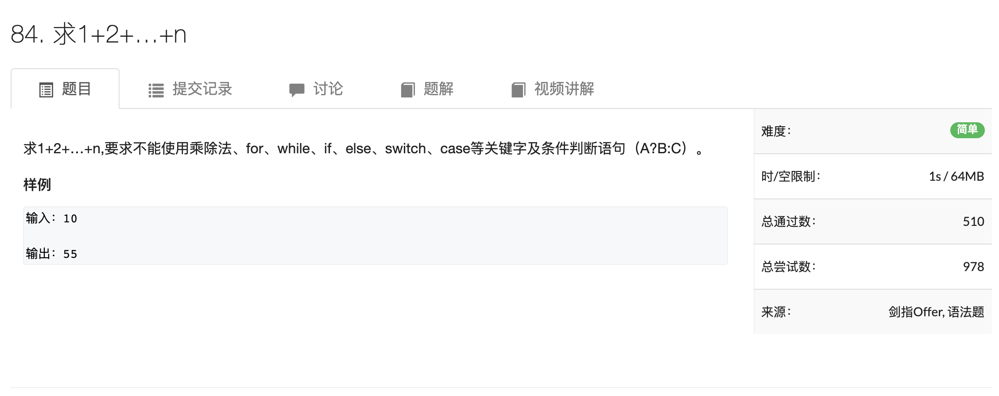
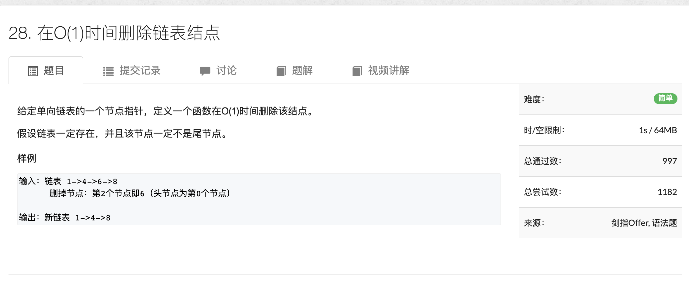
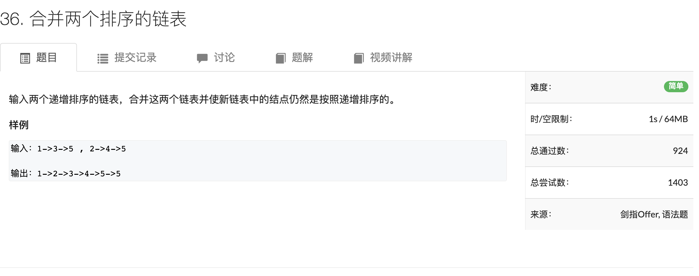
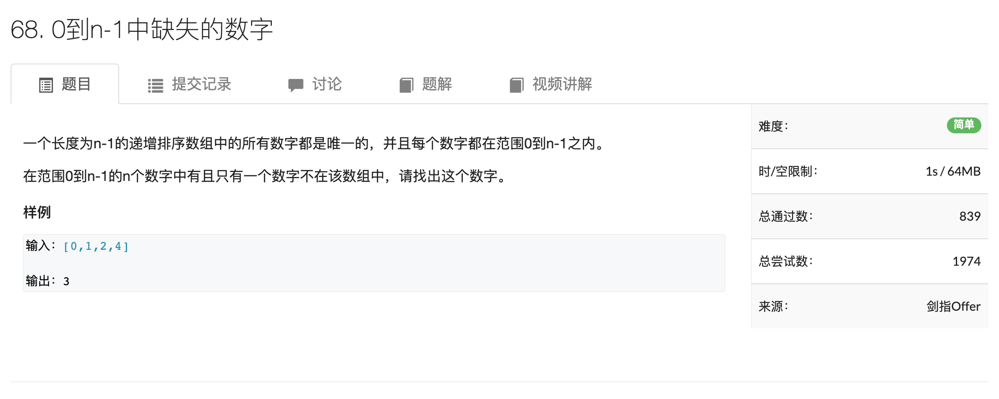
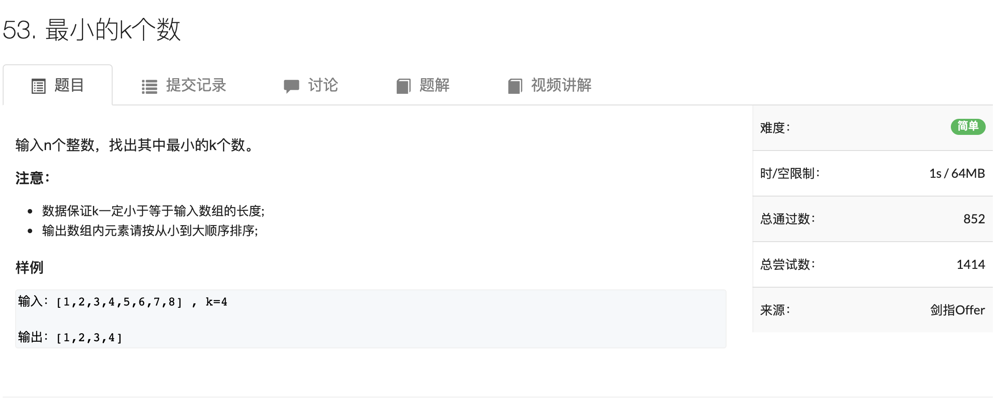
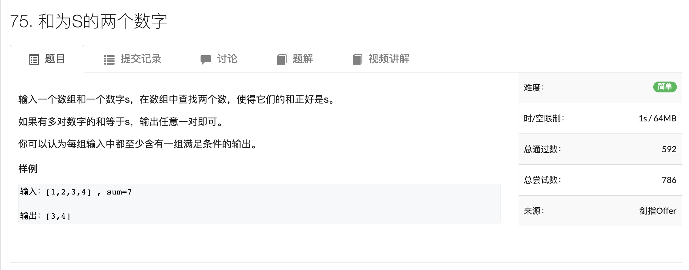
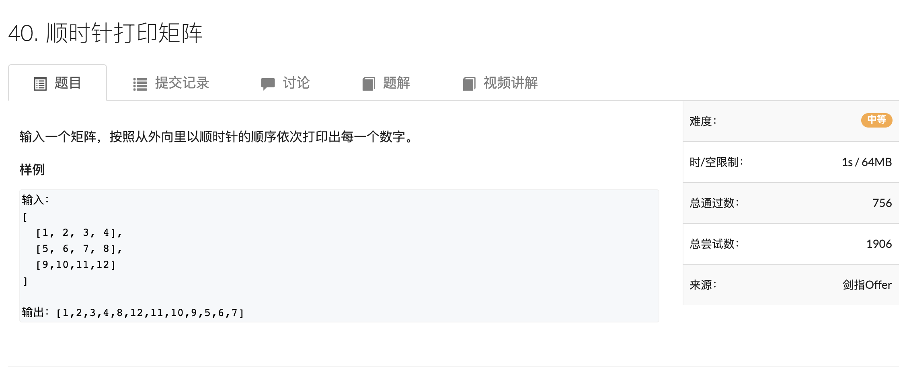

# C++笔记

1 scanf不支持string，或者说，不支持c++的类

2 $max(a, b) = \frac{a + b + abs(a - b)}{2}$

3 while (cir >> x, x): 先输入x再判断x


## 1. AcWing 78.  左旋字符串

分解操作，先整个翻转，再把前n-k个翻转，再把后k个翻转

```c++
string leftRotateString(string str, int n)
{
  int size = str.size();
  reverse(str.begin(), str.end());
  reverse(str.begin(), str.begin() + size - n);
  reverse(str.begin() + size - n, str.begin());
}
```

## 2. AcWing 87. 把字符串转换为整数


```c++
class Solution {
public:
    int strToInt(string str) {
        int k = 0;
        while (k < str.size() && str[k] == ' ') k ++;

        long long number = 0;
        bool is_minus = false;
        if (str[k] == '+') k ++;
        else if (str[k] == '-') k ++, is_minus = true;

        while (k < str.size() && str[k] >= '0' && str[k] <= '9')
        {
            number = number * 10 + str[k] - '0';
            k ++;
        }

        if (is_minus) number *= -1;
        if (number > INT_MAX) return INT_MAX;
        else if (number < INT_MIN) return INT_MIN;
        else return (int)number;
    }
};
```

## 3. AcWing 84. 求1+2+…+n



```c++
class Solution {
public:
    int getSum(int n) {
        int res = n;
        n > 0 && (res += getSum(n - 1));
        return res;
    }
};
```

##4. AcWing 28. 在O(1)时间删除链表结点



```c++
/**
 * Definition for singly-linked list.
 * struct ListNode {
 *     int val;
 *     ListNode *next;
 *     ListNode(int x) : val(x), next(NULL) {}
 * };
 */
class Solution {
public:
    void deleteNode(ListNode* node) {
        
        node->val = node->next->val;
        node->next = node->next->next;
    }
};
```

## 5. AcWing 36. 合并两个排序的链表



```c++
/**
 * Definition for singly-linked list.
 * struct ListNode {
 *     int val;
 *     ListNode *next;
 *     ListNode(int x) : val(x), next(NULL) {}
 * };
 */
class Solution {
public:
    ListNode* merge(ListNode* l1, ListNode* l2) {
        ListNode* dummy = new ListNode(0);
        ListNode* cur = dummy;
        while (l1 != NULL && l2 != NULL)
        {
            if (l1->val < l2->val)
            {
                cur->next = l1;
                l1 = l1->next;
            }
            else
            {
                cur->next = l2;
                l2 = l2->next;
            }
            cur = cur->next;
        }
        if (l1 != NULL) cur->next = l1;
        else cur->next = l2;

        return dummy->next;
    }
};
```

##6. AcWing 35. 反转链表


```c++
/**
 * Definition for singly-linked list.
 * struct ListNode {
 *     int val;
 *     ListNode *next;
 *     ListNode(int x) : val(x), next(NULL) {}
 * };
 */
class Solution {
public:
    ListNode* reverseList(ListNode* head) {
      ListNode* prev = nullptr;
      auto cur = head;
      
      while (cur)
      {
        auto next = cur->next;
        cur->next = prev;
        prev = cur;
        cur = next;
      }
      return prev;
    }
};
```

##7. AcWing 66. 两个链表的第一个公共结点


```c++
/**
 * Definition for singly-linked list.
 * struct ListNode {
 *     int val;
 *     ListNode *next;
 *     ListNode(int x) : val(x), next(NULL) {}
 * };
 */
class Solution {
public:
    ListNode *findFirstCommonNode(ListNode *headA, ListNode *headB) {
        auto p = headA, q = headB;
        while(p != q)
        {
            if (p) p = p->next;
            else p = headB;
            if (q) q = q->next;
            else q = headA;
        }
        return q;
    }
};
```

## 8. AcWing 29. 删除链表中重复的节点


```c++
/**
 * Definition for singly-linked list.
 * struct ListNode {
 *     int val;
 *     ListNode *next;
 *     ListNode(int x) : val(x), next(NULL) {}
 * };
 */
class Solution {
public:
    ListNode* deleteDuplication(ListNode* head) {
        auto dummy = new ListNode(0);
        dummy->next = head;

        auto p = head;
        while (p->next)
        {
            auto q = p->next;
            while (q && p->next->val == q->val) q = q->next;
            if (p->next->next == q) p = p->next;
            else p->next = q;
        }
        return dummy->next;
    }
};
```

## 9. AcWing 68. 0到n-1中缺失的数字



```c++
class Solution {
public:
    int getMissingNumber(vector<int>& nums) {
        if (nums.empty()) return 0;

        int l = 0, r = nums.size();

        while (l < r)
        {
            int mid = l + r >> 1;
            if (nums[mid] != mid) r = mid;
            else l = mid + 1;
        }
        return l;
    }
};
```

## 10. AcWing 17. 从尾到头打印链表


```c++
/**
 * Definition for singly-linked list.
 * struct ListNode {
 *     int val;
 *     ListNode *next;
 *     ListNode(int x) : val(x), next(NULL) {}
 * };
 */
class Solution {
public:
    vector<int> printListReversingly(ListNode* head) {
        vector<int> res;
        while (head)
        {
            res.push_back(head->val);
            head = head->next;
        }
        return vector<int>(res.rbegin(), res.rend());
    }
};
```

## 11. AcWing 20. 用两个栈实现队列


```c++
class MyQueue {
public:
    /** Initialize your data structure here. */
    stack<int> stk, cache;
    MyQueue() {

    }
    void copy(stack<int> &a, stack<int> &b)
    {
        while (a.size())
        {
            b.push(a.top());
            a.pop();
        }
    }

    /** Push element x to the back of queue. */
    void push(int x) {
        stk.push(x);
    }

    /** Removes the element from in front of queue and returns that element. */
    int pop() {
        copy(stk, cache);
        int res = cache.top();
        cache.pop();
        copy(cache, stk);
        return res;
    }

    /** Get the front element. */
    int peek() {
        copy(stk, cache);
        int res = cache.top();
        copy(cache, stk);
        return res;
    }

    /** Returns whether the queue is empty. */
    bool empty() {
        return stk.empty();
    }
};

/**
 * Your MyQueue object will be instantiated and called as such:
 * MyQueue obj = MyQueue();
 * obj.push(x);
 * int param_2 = obj.pop();
 * int param_3 = obj.peek();
 * bool param_4 = obj.empty(); 
 */
```

## 12. AcWing 32. 调整数组顺序使奇数位于偶数前面


```c++
class Solution {
public:
    void reOrderArray(vector<int> &array) {
        int l = 0, r = array.size() - 1;
        while (l < r)
        {
            while (l < r && array[l] % 2 != 0) l ++;
            while (l < r && array[r] % 2 == 0) r --;
            if (l < r) swap(array[l], array[r]);
        }

    }
};
```

## 13. AcWing 53. 最小的k个数



```c++
class Solution {
public:
    vector<int> getLeastNumbers_Solution(vector<int> input, int k) {
        priority_queue<int> heap;
        for (auto x : input)
        {
            heap.push(x);
            if (heap.size() > k) heap.pop();
        }

        vector<int> res;
        while (heap.size()) res.push_back(heap.top()), heap.pop();
        reverse(res.begin(), res.end());


        return res;
    }
};
```

## 14. AcWing 75. 和为S的两个数字



```c++
class Solution {
public:
    vector<int> findNumbersWithSum(vector<int>& nums, int target) {
        unordered_set<int> hash;
        for (int i = 0; i < nums.size(); i ++)
        {
            if (hash.count(target - nums[i])) return vector<int>{target - nums[i], nums[i]};
            hash.insert(nums[i]);
        }
    }
};
```

## 15. AcWing 40. 顺时针打印矩阵



```c++
class Solution {
public:
    vector<int> printMatrix(vector<vector<int> > matrix) {
        vector<int> res;
        if (matrix.empty()) return res;
        int n = matrix.size(), m = matrix[0].size();
        vector<vector<bool>> st(n, vector<bool>(m, false));
        int dx[4] = {0, 1, 0, -1}, dy[4] = {1, 0, -1, 0};
        int x = 0, y = 0, d = 0;
        for (int k = 0; k < n * m; k ++)
        {
            res.push_back(matrix[x][y]);
            st[x][y] = true;
            int a = x + dx[d], b = y + dy[d];
            if (a < 0 || a >= n || b < 0 || b >= m || st[a][b])
            {
                d = (d + 1) % 4;
                a = x + dx[d], b = y + dy[d];
            }
            x = a, y = b;
        }
        return res;
    }
};
```

